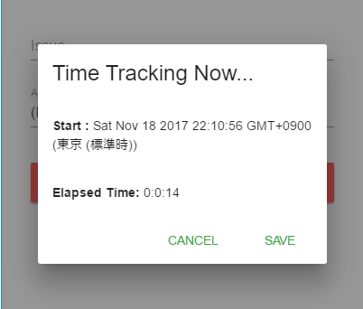

# Redmine Time Tracker

Redmineで時間記録をするためのソフトウェア


## 利用方法

1. 接続先サーバ情報を入力する

    

1. プロジェクトを選択する
1. Issue（チケット）を選択する (必須ではない)
1. アクティビティを選択する
1. STARTをクリック
1. 時間計測がスタートする

    

1. saveをクリックするとそこまでの作業時間がRedmineへPOSTされる

POSTのコメントにはJSONフォーマットで開始時刻と終了時刻がUTC (協定世界時) での 1970 年 1 月 1 日 0 時 0 分 0 秒 から現在までの経過時間記録される

```
{"from":1511004764860,"to":1511004771461}
```

## 利用ライブラリ

- [electron-vue](https://github.com/SimulatedGREG/electron-vue)
- [node-redmine](https://github.com/zanran/node-redmine)
- [vuetify](https://github.com/vuetifyjs/vuetify)